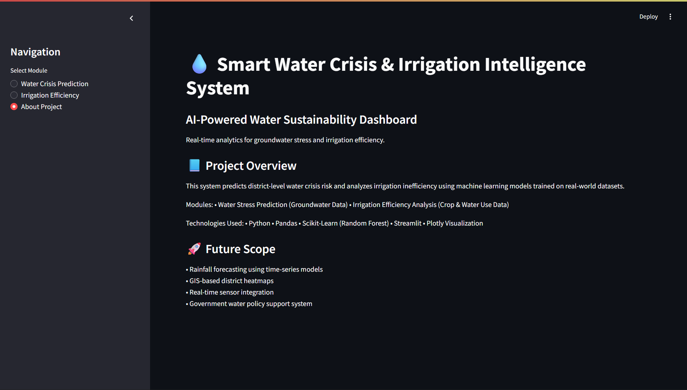
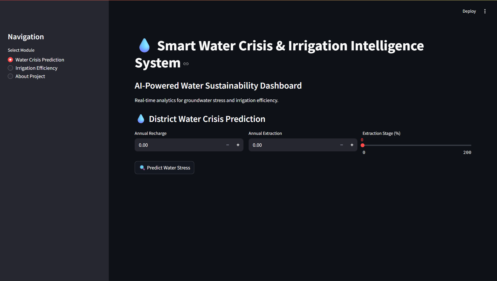
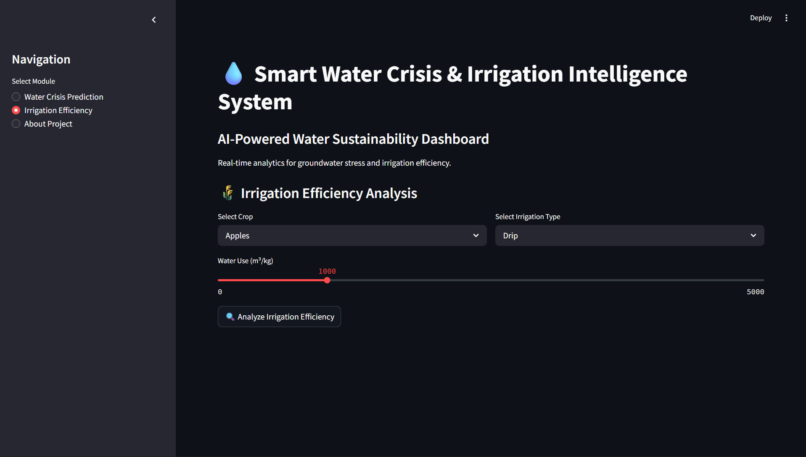

# 💧 Smart Water Crisis & Irrigation Intelligence System
## 🌍 Live Demo

🔗 https://smart-water-intelligence-hrxxngvj9phzpyjrpuacne.streamlit.app/


An AI-powered analytics platform that predicts groundwater stress and detects irrigation inefficiency using Machine Learning.

---

## 📌 Problem Statement

Water crisis and inefficient irrigation are major global challenges.  
Over-extraction of groundwater and poor irrigation practices lead to water depletion and long-term sustainability risks.

This project builds a data-driven decision support system to analyze and predict:

- 💧 District-level Water Stress  
- 🌾 Irrigation Inefficiency  
- 📊 Water Usage Patterns  

---

## 🚀 Key Features

✔ Automated Data Pipeline (ZIP → Extraction → Processing)  
✔ Water Stress Prediction using Groundwater Data  
✔ Irrigation Efficiency Detection using Crop & Water Usage Data  
✔ Random Forest Machine Learning Models  
✔ Feature Importance Visualization  
✔ Interactive Dashboard using Streamlit  
✔ Professional UI with KPI Metrics & Charts  

---

## 🏗️ System Architecture

---

## 🧠 Machine Learning Models

### 1️⃣ Water Crisis Prediction Model
- **Input Features:** Recharge, Extraction, Extraction Stage (%)
- **Output:** Low / Medium / High Water Stress
- **Algorithm:** Random Forest Classifier

### 2️⃣ Irrigation Inefficiency Model
- **Input Features:** Crop Type, Irrigation Type, Water Usage
- **Output:** Efficient / Inefficient
- **Algorithm:** Random Forest Classifier

---

## 📊 Technologies Used

- Python  
- Pandas  
- NumPy  
- Scikit-learn  
- Streamlit  
- Plotly  
- Joblib  

---

## 📷 Dashboard Preview

### 🏠 Main Dashboard


---

### 💧 Water Crisis Prediction Module


---

### 🌾 Irrigation Efficiency Module


---

## 🎯 Real-World Impact

- Helps policymakers identify over-exploited districts  
- Encourages sustainable groundwater management  
- Assists farmers in choosing efficient irrigation methods  
- Converts environmental data into actionable insights  

---

## 🔮 Future Scope

- Rainfall forecasting using time-series models  
- GIS-based district heatmaps  
- Real-time groundwater sensor integration  
- Government decision-support system deployment  

---

## ▶️ How to Run the Project

```bash
# Step 1: Run data pipeline
python -m src.pipeline.run_pipeline

# Step 2: Train models
python -m src.models.train_water_stress
python -m src.models.train_irrigation

# Step 3: Launch dashboard
streamlit run src/app/app.py
👨‍💻 Author

Amarnath Reddy
AI & Machine Learning Enthusiast